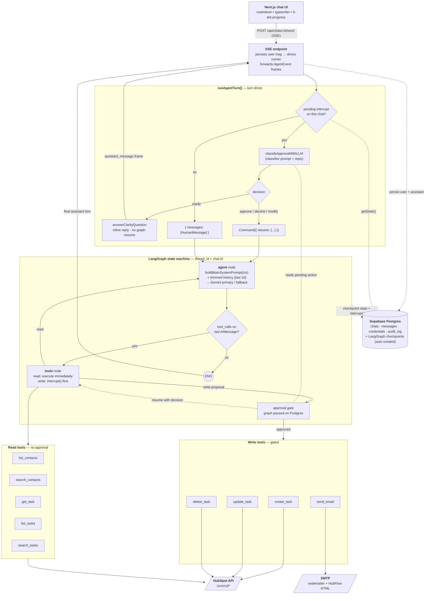

# HubFlow

A conversational agent that manages HubSpot on your behalf — search contacts, list/create/update/delete tasks, and send branded email — with a human-in-the-loop approval gate on every write.

---

## Setup

### 1. Prerequisites

- **Bun** ≥ 1.x — https://bun.sh
- **Supabase project** (or any Postgres with `pgcrypto`) — you'll need its connection string.
- **HubSpot Private App token** with the scopes listed in `docs/tool_defination.md`.
- **Google API key** for Gemini — https://aistudio.google.com/apikey
- **SMTP credentials** (Gmail, SES, Mailtrap, anything) — the `send_email` tool goes over nodemailer, not through HubSpot.

### 2. Install dependencies

```bash
bun i
```

### 3. Configure environment

```bash
cp .env.example .env
```

Then fill in `.env`:

- `DATABASE_URL` — Supabase **session-mode pooler** (port 5432) or the direct connection URI. **Do NOT use the transaction pooler on 6543** — LangGraph's `PostgresSaver` relies on prepared statements which that pooler does not support.
- `ENCRYPTION_KEY` — a random string ≥ 32 chars. Used to encrypt HubSpot tokens at rest with AES-256-GCM. Generate one with:
  ```bash
  openssl rand -base64 48
  ```
- `SMTP_*` — outbound email transport. `.env.example` includes presets for Gmail, Outlook 365, and Mailtrap.
- `GOOGLE_API_KEY`, `GOOGLE_MODEL_PRIMARY`, `GOOGLE_MODEL_FALLBACK` — the two Gemini models. The agent tries the primary first and transparently falls back to the secondary on rate limits or 5xx.
- `LANGSMITH_*` — optional. Set `LANGSMITH_TRACING=true` + an API key to trace every agent run in LangSmith.

### 4. Run migrations

The schema lives under `supabase/migrations/`. Apply it once against your database — pick whichever workflow matches your setup.

**With the Supabase CLI** (recommended for local dev with `supabase start`):

```bash
supabase db push
```

**Against a remote Supabase project** (from Supabase Studio → SQL Editor):

Copy the contents of `supabase/migrations/20260801000000_init_hubflow_tables.sql` and paste into the SQL Editor, then run.

**Direct against any Postgres** (`psql`):

```bash
psql "$DATABASE_URL" -f supabase/migrations/20260801000000_init_hubflow_tables.sql
```

This creates four tables — `credentials`, `chats`, `messages`, `audit_log` — all with RLS enabled and no policies (the server bypasses RLS with its service-role connection; the empty policy set is what protects the anon key). LangGraph's own `checkpoints` tables are created automatically on first agent run by the Postgres checkpointer.

### 5. Save your HubSpot token

```bash
bun run dev
```

Open http://localhost:3000, click **Settings** in the sidebar, and paste your HubSpot Private App token. It's encrypted at rest immediately; the raw value is never rendered again after save (only masked bullets).

### 6. Start using the agent

Click **New Chat**, type a request, and hit Enter. Try:

- `list my contacts`
- `search for tasks about the Northern Rail deal`
- `create a task tomorrow at 9am to follow up with Brian Halligan, high priority`
- `send an email to jane@example.com with subject "Welcome to HubFlow"`

Any write is held for your approval — reply **yes**, or say what to change (`actually make it high priority`) and the agent re-plans without losing context.

---

## What HubFlow does

HubFlow is a chat surface on top of a LangGraph agent that operates HubSpot for you and drafts outbound email. It's aimed at CRM operators who want to keep working in natural language without giving up the confirmation step before anything gets written.

### Architecture at a glance

The full request lifecycle — from a chat message to a HubSpot write — goes through five moving parts: the SSE endpoint, the turn driver (`runAgentTurn`), the LangGraph state machine, the LLM-driven approval gate, and the tool functions themselves. Postgres is the persistence layer for both the app's tables and LangGraph's own checkpoints.



Reading the diagram:

- **Every turn starts at the SSE endpoint.** The user message is written to `messages` before the runner is even invoked, so a mid-turn disconnect never loses input.
- **`runAgentTurn` is the branch point.** Before touching the graph it asks the checkpointer whether this chat has a pending interrupt. If yes → classify the reply through a small Gemini call. If no → wrap the reply as a fresh `HumanMessage`.
- **The clarify decision short-circuits the graph.** No `Command({ resume })` gets sent; the interrupt stays paused on Postgres, and the next reply re-enters the classifier against the same proposal.
- **The other three decisions resume the graph** with `Command({ resume: { approved, feedback?, followUpNote? } })`. The tools node reads that value, executes (or synthesizes a rejection `ToolMessage`), and the agent runs again to compose the final reply.
- **Reads bypass the gate entirely** — they emit progress events (`Fetching your contact list…`) but never interrupt.
- **`send_email` is the only tool that doesn't touch HubSpot.** It goes over SMTP via nodemailer with the HubFlow-branded HTML template. The main prompt tells the agent to warn the user this won't appear on the HubSpot timeline.

### The agent

- Built on **LangGraph 1.x** — a two-node state machine (`agent` ↔ `tools`) with a Postgres checkpointer so every conversation resumes exactly where it stopped, including a paused approval.
- Powered by **Gemini** via `@langchain/google-genai`, with automatic fallback between two configured models.
- Chat state is trimmed to the last 10 messages before every LLM call, so token cost stays flat per turn regardless of transcript length.
- Traceable in **LangSmith** by setting a single env var.

### The tools

Read tools run immediately, no approval:

- `list_contacts`, `search_contacts` — look up HubSpot contacts.
- `list_tasks`, `search_tasks`, `get_task` — find tasks with filters, sorts, associations.

Write tools go through the approval gate:

- `create_task`, `update_task`, `delete_task` — task CRUD. Task↔contact associations use `HUBSPOT_DEFINED / 204` by default.
- `send_email` — HubFlow-branded transactional email over SMTP (nodemailer), independent of HubSpot.

Each tool is a plain function under `lib/hubspot/` and `lib/mailer/` bound to Gemini via `bindTools`. No REST endpoints — the agent calls them in-process. Schemas and docstrings live in `docs/tool_defination.md`.

### The approval gate

When the model proposes a write, execution pauses via `interrupt()` and the UI shows exactly what's about to happen ("I'm about to create task 'X' due tomorrow, HIGH priority — reply yes to confirm"). Your reply is classified by a small dedicated Gemini call as **approve / decline / modify / clarify**:

- **approve** — natural-language yes (`yes`, `go ahead`, `sounds good`, `👍`, …) resumes the graph and the tool runs. If the reply tacks on an extra request (`yes, and remind me next week`), the `note` is threaded through as feedback so the main agent addresses it after the write completes.
- **decline** — natural-language no (`cancel`, `no`, `nope`, `stop`, …) resumes with rejection and the reason is passed as feedback.
- **modify** — anything that names a change (`actually make it high priority`, `use a different date`) is parsed for the requested change, resumes as rejection, and the change description is fed back to the main agent so it re-proposes the same action with the new arguments — no need to repeat context.
- **clarify** — the reply is a question or hesitation (`when is it due again?`, `which contact?`, `hmm`). A tiny answerer LLM produces a 1–3 sentence factual answer grounded in the proposal + recent transcript, and **the graph is NOT resumed** — the interrupt stays pending, so the next reply gets re-classified against the same proposal.

This is why replying with `"yeah please go ahead"` works, `"make it high priority"` doesn't kill the pending action (it iterates on it), and `"when is that due again?"` gets you an answer instead of an accidental decline.

### The frontend

- Next.js 16 App Router with Turbopack.
- Sidebar + chat surface, all styled with Tailwind v4 and shadcn/base-ui primitives. Icons are `@tabler/icons-react` with filled variants used to indicate active state.
- Chat streams over SSE from `POST /api/chats/:id/send` — progress events (`Fetching your contact list…`, `Composing a response…`) render a three-dot loader inside a placeholder bubble, then a typewriter reveal for the final markdown reply.
- Every user turn saves to the `messages` table on the server before the stream starts, so a mid-turn disconnect never loses input.

### The data model

Four tables (see `supabase/migrations/20260801000000_init_hubflow_tables.sql`):

| Table | Purpose |
|---|---|
| `credentials` | Encrypted HubSpot tokens. Unique `id`; the Settings page rotates in place so bound chats keep working. |
| `chats` | Conversations. Optional `credential_id` binds a chat to a specific credential; unbound chats use the default. |
| `messages` | Ordered by `sequence`, not timestamp — two rows written in the same millisecond during streaming still render deterministically. `client_uuid` gives idempotent inserts. |
| `audit_log` | Append-only trace of tool calls. |

LangGraph adds its own `checkpoints` / `checkpoint_writes` / `checkpoint_migrations` tables automatically on first agent run.

### Endpoints

The stable surface, all under `/api/*`:

- `GET/POST /api/chats`, `GET/PATCH/DELETE /api/chats/:id` — chat CRUD.
- `GET/POST /api/chats/:id/messages` — message history.
- `POST /api/chats/:id/send` — **SSE endpoint the chat UI talks to**. Streams progress + assistant frames.
- `GET/POST /api/credentials`, `GET/PATCH/DELETE /api/credentials/:id` — the Settings page's backing surface.
- `GET/POST /api/audit` — append-only write trace.

Details in `docs/api_reference.md`. The former test endpoints under `/api/hubspot/*` have been removed — the agent calls tool functions in-process.

---

## Repo tour

```
app/                          Next.js App Router
  (shell)/                    Route group — chat + settings pages share the sidebar
    layout.tsx                Wraps children in <AppShell>
    page.tsx                  Landing greeting
    chats/[id]/page.tsx       Active conversation
    settings/page.tsx         HubSpot token management
  api/                        Route handlers (JSON + SSE)
components/features/          App-specific components (chat, shell, settings)
components/ui/                shadcn primitives
lib/
  agent/                      LangGraph agent — model, graph, tools, prompt, approval gate
  hubspot/                    In-process HubSpot tool functions
  mailer/                     nodemailer transport + HubFlow-branded HTML template
  db/                         Postgres client + AES-256-GCM envelope
  models/                     Typed DB accessors (chats, messages, credentials, audit)
docs/
  api_reference.md            HTTP surface
  tool_defination.md          Agent tools — schemas, defaults, implementer notes
supabase/migrations/          Postgres DDL
```

---

## Common tasks

- **Add a new HubSpot tool.** Write the function in `lib/hubspot/`, add a `tool(...)` wrapper in `lib/agent/tools.ts` with a Zod schema, register it in `AGENT_TOOLS`. If it mutates state, add its name to `WRITE_TOOL_NAMES` so the approval gate catches it, and add a friendly summary in `buildApprovalSummary`. Restart the dev server — the compiled graph is cached on `globalThis`.
- **Swap models.** Change `GOOGLE_MODEL_PRIMARY` / `GOOGLE_MODEL_FALLBACK` in `.env`. Restart. No code changes.
- **Change the confirmation phrasing.** Edit `buildApprovalSummary` in `lib/agent/graph.ts` — it's deterministic string templating, no LLM cost.
- **Reset a chat's agent state** (e.g. an interrupted run got stuck). Delete the chat in the sidebar and start a new one — the checkpoint is keyed on `chat_id`.

---

## Troubleshooting

- **`GET / 404`** — usually a corrupt `.next/dev/types/` cache from an interrupted dev server. Fix: stop the server, `rm -rf .next`, restart.
- **`(0 , … .bindTools)(...).bindTools is not a function`** — you changed model wiring without restarting; the cached compiled graph still holds a stale runnable. Restart `bun run dev`.
- **`400 Bad Request … Unknown name "exclusiveMinimum"`** from Gemini — a Zod schema on a tool includes `.positive()`, `.min(N)` on a number, etc. Gemini's function-calling schema rejects `exclusiveMinimum`. Drop the numeric bound or use `.optional()`.
- **Approval loop replies `"user did not approve"` on `"yes, go ahead"`** — the LLM classifier failed and the heuristic fallback kicked in. Check `LANGSMITH_TRACING` output; the fallback treats anything not in a small yes-set as a decline.
- **SMTP `transporter.verify()` returns `500`** — one of `SMTP_HOST` / `SMTP_USER` / `SMTP_PASS` is empty. The response body names the missing var.
